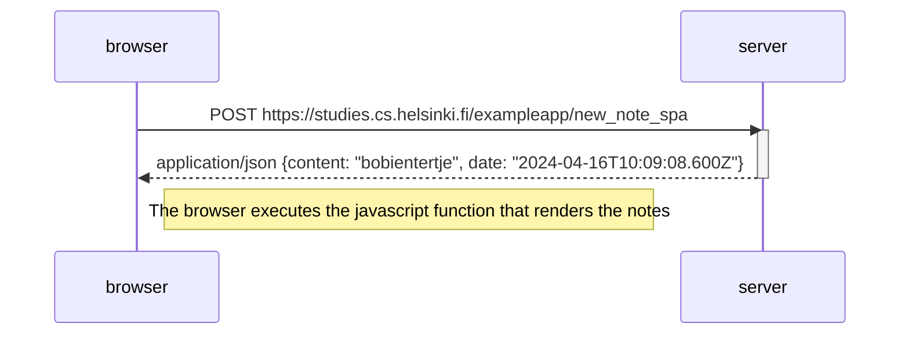

# Exercise 6

```mermaid
sequenceDiagram
    participant browser
    participant server

    browser->>server: POST https://studies.cs.helsinki.fi/exampleapp/new_note_spa
    activate server
    server-->>browser: application/json {content: "bobientertje", date: "2024-04-16T10:09:08.600Z"}
    deactivate server

    Note right of browser: The browser executes the javascript function that renders the notes
```